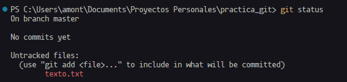
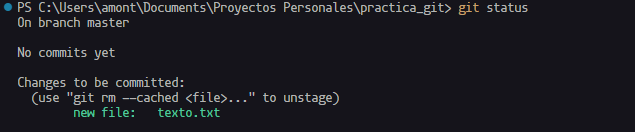
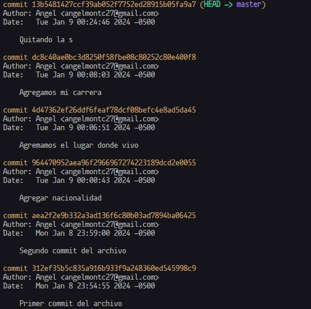

## Git y github

Cuando editamos un archivo y queremos inicar **GIT**, usamos el comando **`GIT INIT`**, luego tenemos que agregar el comando **`GIT ADD 'NOMBRE DE ARCHIVO'`** para agregar los cambios en memoria, sino aparece el siguiente inconveniente si usamos **`GIT STATUS`**

Para agregar cambios en el archivo se usa **`GIT ADD NOMBREARCHIVO`** luego si hacemos **`GIT STATUS`** nos saldra los siguiente:

Nos arroja el archivo en color verde, porque falta agregar **`GIT COMMIT -M "COMENTARIO"`** el comando sirve para guardar los cambios que hay en la cache en el repositorio, el cual luego es representado por una instancia de tiempo el cual se hizo dicho cambio, es decir crear un punto de historia de cambio, para luego si el usuario quiere, revertir los cambios.

Se puede usar infinitos commits para cada cambio pero solo una vez por ejecucion de **`GIT ADD`**, luego para ver el historia de commits, usamos el comando **`GIT LOG`**

